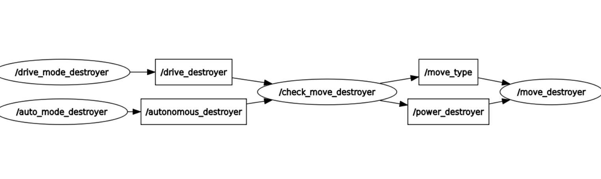

# Tugas Day 2 SEKURO 18

## Deskripsi Singkat

Sebuah implementasi dari desain sederhana robot dengan nama "Destroyer II". Program ditulis menggunakan framework ROS 2 dengan bahasa C++ yang didevelop pada Ubuntu LTS 22. Di sini robot disusun dari 2 buah node Publisher, 1 node Publisher-Subscriber, dan 1 node Subscriber. Robot memiliki fitur untuk bergerak dengan dikendalikan melalui input ataupun secara random

## Dependencies
Agar dapat menjalankan program, sistem harus sudah memasang Ubuntu LTS 22 (WSL/Native), ROS 2 (mencakup rclcpp, ament_cmake, geometry_msgs, std_msgs, launch_ros), dan CMAKE

## Cara menjalankan Program
1. Pastikan seluruh dependencies sudah terinstall dan sudah berada di OS Ubuntu
2. Clone atau download repo/release program dari github
3. Masuk ke folder src/destroyer
4. eksekusi command `colcon build`
5. Jalankan setup bash pada folder yang sama dengan menjalankan command `source install/setup.bash` (bisa menyesuaikan shell lain, seperti zsh)
6. Jalankan keempat node dengan cara memanggil `ros2 run destroyer <nama-node>` dengan nama node sebagai berikut
 - auto_mode_destroyer
 - drive_mode_destroyer
 - check_move_destroyer
 - move_destroyer

## Identitas Perancang

- Renuno Yuqa Frinardi
- NIM 13524080
- Prodi Teknik Informatika
